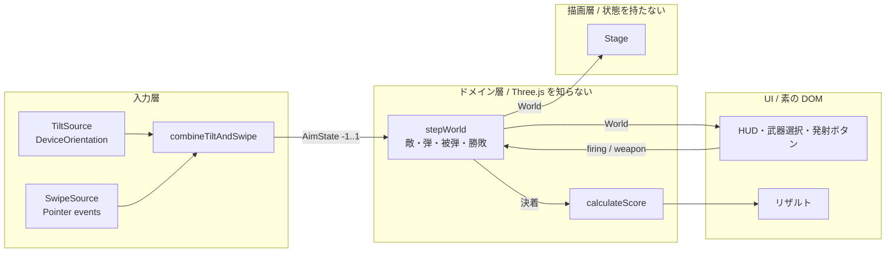

# sea-strike 実装概要（M0〜M5）

公開先: https://bubbleshaker.github.io/sea-strike/

スマホを傾けて（あるいはスワイプして）狙い、海上を飛びながら敵戦闘機を撃ち落とす
一人称視点の 3D シューティング。20 機撃墜で勝ち、HP が尽きれば負け。
スコアは撃墜数・クリアタイム・命中率・被弾から出す。

## 全体像

依存はすべて内向き。`src/game/**` から `three` と DOM への import は 1 つも無く、
ヘッドレスでテストできる（テスト 72 件）。

## 設計上の勘所

### 1. 傾きとスワイプを「同じ形」にしてから渡す

要件の「傾けられない時にスワイプで同等の操作」を、調整ではなく構造で満たしている。

両方の入力源は `AimState { x, y }`（-1..1 の変位）だけを返し、**角度に直すのは
ゲーム側の仕事**にした。入力層は可動範囲（yaw ±60°, pitch ±40°）を知らないので、
両者が同じ範囲を同じ速さで狙えることが自動的に保たれる。

さらに `combineTiltAndSwipe` が両方の耳を開けたまま値だけを選ぶので、
「許可はしたがセンサーが動かない」「机に置いた」でも操作不能にならない。
切り替わる瞬間は引き継ぐ側を今の照準に合わせ、値が飛ばないようにしている。

### 2. 世界は純関数で進める

`stepWorld(world, command, dt, random)` は新しい世界を返すだけで、渡された world を
書き換えない（`JSON.stringify` 比較のテストで固定）。乱数を引数で受けるので、
敵の出現も再現できる。

これにより「当て続ければ落とせる」「貫通弾は同じ機体に二度当たらない」
「HP が尽きたら世界が止まる」といった企画そのものを、WebGL を立ち上げずに検証できる。

### 3. フレームレートに左右されないこと

スマホが本番なので、端末の速さで手応えが変わらないことを明示的に守っている。

- 照準の追従は `1 - e^(-k·dt)`（線形補間だと fps で手応えが変わる）
- 連射間隔は行き過ぎたぶんを次に繰り越す（切り捨てると低 fps 端末ほど火力が落ちる）
- 当たり判定は前フレームとの線分で見る（点で見ると 900m/s の弾が敵をすり抜ける）

いずれもテストで固定してある。

### 4. 描画は世界の状態を持たない

`stage.render(time, dt, world)` は渡された世界をその通り見せるだけ。敵も弾も
プール（使い回し）で、生成も削除もしない。爆発は「そのフレームの出来事」
（`WorldEvent`）を見て一度きりの光を置く。

持たないのは**世界の状態**であって、演出の状態は持つ。光の残り寿命、破片の
飛び方、揺れの残量は `effects` の中にある。これらは世界の側が知る必要のないもの
（無くてもゲームは同じように成立する）なので、描画層に閉じている。

## モバイル向けに効かせたこと

- 弾は `InstancedMesh` で 1 回の描画命令にまとめる（連射すると常時 100 発以上飛ぶ）
- 弾の見かけの大きさは距離で決める（実寸だと目の前で画面を覆い、遠くで消える）
- 敵機のジオメトリ・材質は全機で共有
- 海は 9000m 四方 / 192 分割。フォグが飽和する距離から板の大きさを決めている
- さざ波は頂点ではなくフラグメントの法線で作る（1 マス 47m の格子には収まらない）
- DPR2 以上の端末では antialias を落とす

## 遊びの設計

| | 値 | なぜ |
|---|---|---|
| 前進速度 | 150m/s 固定 | レール式。敵の出現位置の意味を一定に保つ |
| 敵の出現 | 前方 1200m、左右 ±240m、自機高度 ±55m | 縦持ちの横視野は約 40 度しかない |
| 目標 | 20 機 | 長いと中だるみし、短いと持ち替える暇がない |
| 目標時間 | 60 秒 | 全弾必中で 30 秒強。緩いと勝った人が全員満点になる |
| 敵の射撃 | 前進ぶんだけ先読み | 「真っ直ぐ飛べば当たる、機首を振れば外れる」 |

弾 5 種は強さの階段ではなく用途の違い。威力・弾速・連射・弾数を互いに削り合わせ、
どれか一つが常に最適にならないようにしている。

## 捨てた案

- **速度線**（空中に筋を撒いて後方へ流す）: どれだけ薄くしても雨にしか見えず、
  飛んでいる速さではなく天候の情報になってしまうため削除した。
- **音**: 素材を持たない方針なので合成することになり、モバイルの自動再生制限の
  扱いも要る。手応えの主要因ではないので後回し。
