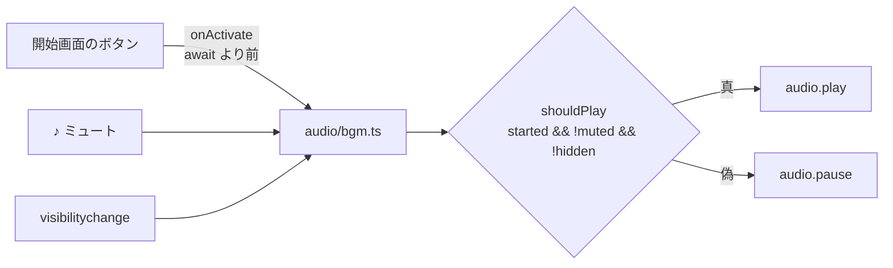

# BGM を入れた（M6）

公開先: https://bubbleshaker.github.io/sea-strike/

曲は **Starry Eyed / YM-2608 Chiptune**（[音楽素材 MusMus](https://musmus.main.jp/)、作曲: watson）。
チップチューンなので、海面と敵機だけの画に古い携帯機の手触りが乗る。

## 素材の入手経路

きっかけは YouTube のリンクだったが、**YouTube から音声を抜き出すのは規約違反**になる。
同じ曲を **MusMus 公式が mp3 で配布している**ので、そちらを取得した。

MusMus の利用規約は、ゲームへの BGM 利用を明示的に許諾している。条件は**著作権表示**で、
開始画面・README・PLAN.md に出した。規約が禁じる「2 次配布」は FAQ で
「MusMus にアクセスせずに楽曲を素材として使用できる状態」と定義されている。ゲームへの
同梱はこれに当たらないが、public リポジトリなので `src/assets/NOTICE.md` に
「素材として取り出さないこと」を明記した。

## 構造



- 音は `src/audio/` として独立した層にした。`game/`（ドメイン層）は音を知らないまま
- 「鳴っているべきか」を `shouldPlay` 一つに集めた。純関数なので、音を出さずにテストできる
- ミュートの状態は `Bgm` だけが持つ。UI（`ui/mute-button.ts`）は読んで描くだけ

`play()` と `pause()` を条件ごとに散らすのではなく、**一つの述語を実際の再生に写す**形にしてある。
条件が増えても（例えば「リザルト中は音量を下げる」）、増えるのは述語の側だけで済む。

## ブラウザの制約と、その扱い

ここが実装の大半を占めた。

### 1. ユーザーが操作するまで音は鳴らせない

ブラウザは、ユーザーの操作から始まっていない `play()` を拒む（勝手に音を出すページ対策）。
だから**開始画面のボタンを押した瞬間**に鳴らし始める。

さらに厄介なのは、傾き操作を選んだときに挟まる**許可ダイアログ**。

```ts
onActivate()                              // ← ここで鳴らす（同期）
const granted = await requestTiltPermission()  // ← これを跨ぐと操作起点でなくなる
```

`await` の後で `bgm.start()` を呼ぶと、iOS では「ユーザーの操作から始まった処理」と
見なされず拒まれる。**await より前**に済ませる必要がある。

### 2. 拒まれたあと、黙ってはいけない

省電力モードなど、操作起点でも `play()` が失敗することはある。失敗を握りつぶすだけだと
ボタンは「♪ ON」なのに一生鳴らない。次の `pointerdown` で一度だけ鳴らし直す。

`pause()` は保留中の `play()` を失敗させるので、その失敗が再試行の予約へ回らないよう、
「鳴らすべき状態か」を予約の条件に入れてある（レビュー指摘）。

### 3. タブを離れたら止める

`stop` ではなく `pause`。曲の位置が残るので、戻ったときに続きから鳴る。

## 決めなかったこと

- **効果音（発砲・着弾・爆発）**は入れていない。毎フレーム鳴る量の管理と素材の粒度の設計が要る。
  手応えには効くはずなので、次に音を触るときの候補
- `preload='auto'` で 2.1MB を先読みしている。three.js の初期化と帯域を奪い合う可能性があるが、
  実測していないので据え置いた
